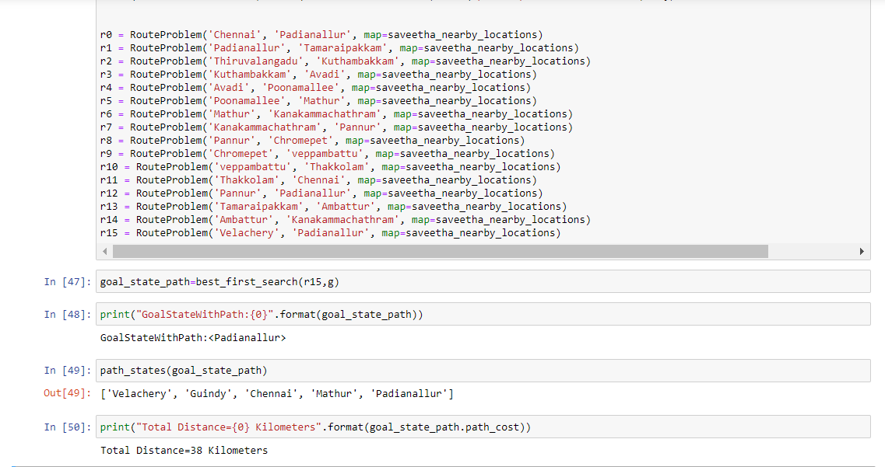
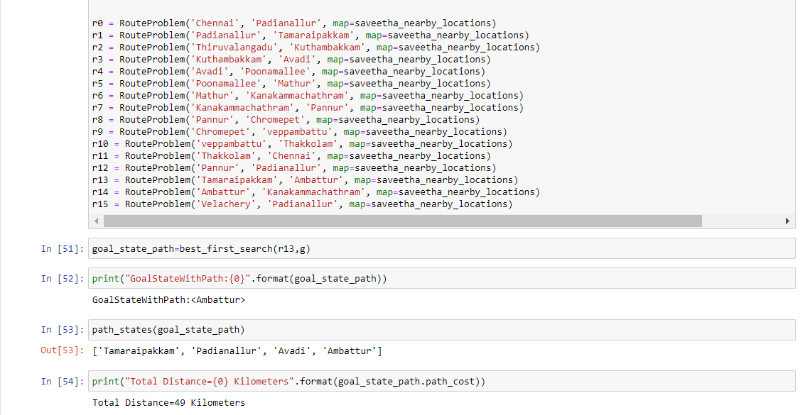

## EX NO:01
## DATE:4.4.22
# <p align="center">Dijkstra's Shortest Path Algorithm
## AIM

To develop a code to find the shortest route from the source to the destination point using Dijkstra's shortest path algorithm.

## THEORY
Explain the problem statement

## DESIGN STEPS

### STEP 1:
Identify a location in the google map:

### STEP 2:
Select a specific number of nodes with distance

### STEP 3:
Import required packages.

### STEP 4:
Include each node and its distance separately in the dictionary data structure.

### STEP 5:
End of program.

## ROUTE MAP
#### Include your own map
#### Example map


## PROGRAM
```python3
Developed by:Prashethaa R
Register No :212220230036
    
%matplotlib inline
import matplotlib.pyplot as plt
import random
import math
import sys
from collections import defaultdict, deque, Counter
from itertools import combinations
import heapq

class Problem(object):
    """The abstract class for a formal problem. A new domain subclasses this,
    overriding `actions` and `results`, and perhaps other methods.
    The default heuristic is 0 and the default action cost is 1 for all states.
    When yiou create an instance of a subclass, specify `initial`, and `goal` states 
    (or give an `is_goal` method) and perhaps other keyword args for the subclass."""

    def __init__(self, initial=None, goal=None, **kwds): 
        self.__dict__.update(initial=initial, goal=goal, **kwds) 
        
    def actions(self, state):        
        raise NotImplementedError
    def result(self, state, action): 
        raise NotImplementedError
    def is_goal(self, state):        
        return state == self.goal
    def action_cost(self, s, a, s1): 
        return 1
    
    def __str__(self):
        return '{0}({1}, {2})'.format(
            type(self).__name__, self.initial, self.goal)

class Node:
    "A Node in a search tree."
    def __init__(self, state, parent=None, action=None, path_cost=0):
        self.__dict__.update(state=state, parent=parent, action=action, path_cost=path_cost)

    def __str__(self): 
        return '<{0}>'.format(self.state)
    def __len__(self): 
        return 0 if self.parent is None else (1 + len(self.parent))
    def __lt__(self, other): 
        return self.path_cost < other.path_cost

failure = Node('failure', path_cost=math.inf) # Indicates an algorithm couldn't find a solution.
cutoff  = Node('cutoff',  path_cost=math.inf) # Indicates iterative deepening search was cut off

def expand(problem, node):
    "Expand a node, generating the children nodes."
    s = node.state
    for action in problem.actions(s):
        s1 = problem.result(s, action)
        cost = node.path_cost + problem.action_cost(s, action, s1)
        yield Node(s1, node, action, cost)
        

def path_actions(node):
    "The sequence of actions to get to this node."
    if node.parent is None:
        return []  
    return path_actions(node.parent) + [node.action]


def path_states(node):
    "The sequence of states to get to this node."
    if node in (cutoff, failure, None): 
        return []
    return path_states(node.parent) + [node.state]

class PriorityQueue:
    """A queue in which the item with minimum f(item) is always popped first."""

    def __init__(self, items=(), key=lambda x: x): 
        self.key = key
        self.items = [] # a heap of (score, item) pairs
        for item in items:
            self.add(item)
         
    def add(self, item):
        """Add item to the queuez."""
        pair = (self.key(item), item)
        heapq.heappush(self.items, pair)

    def pop(self):
        """Pop and return the item with min f(item) value."""
        return heapq.heappop(self.items)[1]
    
    def top(self): return self.items[0][1]

    def __len__(self): return len(self.items)

def best_first_search(problem, f):
    "Search nodes with minimum f(node) value first."
    node = Node(problem.initial)
    frontier = PriorityQueue([node], key=f)
    reached = {problem.initial: node}
    while frontier:
        node = frontier.pop()
        if problem.is_goal(node.state):
            return node
        for child in expand(problem,node):
            s = child.state
            if s not in reached or child.path_cost < reached[s].path_cost:
                reached[s] = child
                frontier.add(child)
    return failure

def g(n):
    # Write your code here ; modify the below mentioned line to find the actual cost
    return n.path_cost

class RouteProblem(Problem):
    """A problem to find a route between locations on a `Map`.
    Create a problem with RouteProblem(start, goal, map=Map(...)}).
    States are the vertexes in the Map graph; actions are destination states."""
    
    def actions(self, state): 
        """The places neighboring `state`."""
        return self.map.neighbors[state]
    
    def result(self, state, action):
        """Go to the `action` place, if the map says that is possible."""
        return action if action in self.map.neighbors[state] else state
    
    def action_cost(self, s, action, s1):
        """The distance (cost) to go from s to s1."""
        return self.map.distances[s, s1]
    
    def h(self, node):
        "Straight-line distance between state and the goal."
        locs = self.map.locations
        return straight_line_distance(locs[node.state], locs[self.goal])

class Map:
    """A map of places in a 2D world: a graph with vertexes and links between them. 
    In `Map(links, locations)`, `links` can be either [(v1, v2)...] pairs, 
    or a {(v1, v2): distance...} dict. Optional `locations` can be {v1: (x, y)} 
    If `directed=False` then for every (v1, v2) link, we add a (v2, v1) link."""

    def __init__(self, links, locations=None, directed=False):
        if not hasattr(links, 'items'): # Distances are 1 by default
            links = {link: 1 for link in links}
        if not directed:
            for (v1, v2) in list(links):
                links[v2, v1] = links[v1, v2]
        self.distances = links
        self.neighbors = multimap(links)
        self.locations = locations or defaultdict(lambda: (0, 0))

        
def multimap(pairs) -> dict:
    "Given (key, val) pairs, make a dict of {key: [val,...]}."
    result = defaultdict(list)
    for key, val in pairs:
        result[key].append(val)
    return result

# Create your own map and define the nodes

saveetha_nearby_locations = Map(
    {('Chennai', 'Mathur'):  13, ('Mathur', 'Padianallur'): 10, ('Padianallur', 'Tamaraipakkam'): 17,
     ('Tamaraipakkam', 'Thiruvallur'): 20, ('Thiruvallur', 'Kanakammachathram'): 24, ('Thiruvallur', 'Thiruvalangadu'): 20, 
     ('Thiruvalangadu', 'Thakkolam'):  16, ('Thakkolam', 'Perambakkam'): 12, ('Perambakkam', 'Pannur'): 9, 
     ('Pannur', 'Thakkolam'): 22, ('Perambakkam', 'Polivakkam'): 16, ('Pannur', 'Sriperumbudur'):  13, ('Sriperumbudur', 'Polivakkam'): 12, 
     ('Sriperumbudur', 'Kuthambakkam'): 13, ('Kuthambakkam', 'Poonamallee'): 11, ('Poonamallee','Thandalam'): 13, ('Thandalam','Chromepet'): 10, 
     ('Guindy','Velachery'): 3, ('Guindy','Chennai'): 12, ('Poonamallee','Perumalpattu'): 17, ('Perumalpattu','veppambattu'): 4, 
     ('Perumalpattu','Avadi'): 17, ('Avadi','Ambattur'): 10, 
     ('Ambattur','Chennai'): 16, ('Padianallur','Avadi'): 22,('perumalpattu','Thiruvallur'):23})


r0 = RouteProblem('Chennai', 'Padianallur', map=saveetha_nearby_locations)
r1 = RouteProblem('Padianallur', 'Tamaraipakkam', map=saveetha_nearby_locations)
r2 = RouteProblem('Thiruvalangadu', 'Kuthambakkam', map=saveetha_nearby_locations)
r3 = RouteProblem('Kuthambakkam', 'Avadi', map=saveetha_nearby_locations)
r4 = RouteProblem('Avadi', 'Poonamallee', map=saveetha_nearby_locations)
r5 = RouteProblem('Poonamallee', 'Mathur', map=saveetha_nearby_locations)
r6 = RouteProblem('Mathur', 'Kanakammachathram', map=saveetha_nearby_locations)
r7 = RouteProblem('Kanakammachathram', 'Pannur', map=saveetha_nearby_locations)
r8 = RouteProblem('Pannur', 'Chromepet', map=saveetha_nearby_locations)
r9 = RouteProblem('Chromepet', 'veppambattu', map=saveetha_nearby_locations)
r10 = RouteProblem('veppambattu', 'Thakkolam', map=saveetha_nearby_locations)
r11 = RouteProblem('Thakkolam', 'Chennai', map=saveetha_nearby_locations)
r12 = RouteProblem('Pannur', 'Padianallur', map=saveetha_nearby_locations)
r13 = RouteProblem('Tamaraipakkam', 'Ambattur', map=saveetha_nearby_locations)
r14 = RouteProblem('Ambattur', 'Kanakammachathram', map=saveetha_nearby_locations)
r15 = RouteProblem('Velachery', 'Padianallur', map=saveetha_nearby_locations)

goal_state_path=best_first_search(r13,g)

print("GoalStateWithPath:{0}".format(goal_state_path))

path_states(goal_state_path) 

print("Total Distance={0} Kilometers".format(goal_state_path.path_cost))    
```

## OUTPUT:



## SOLUTION:
This program will find the minimum distance between locations using BEST-FIRST search.
## RESULT:
Thus the program developed for finding route with drawn map and finding its minimum distance covered.

